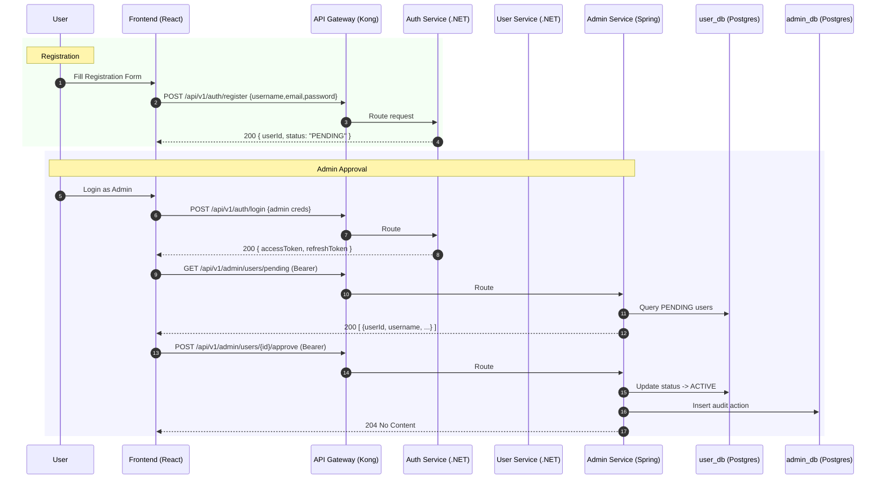
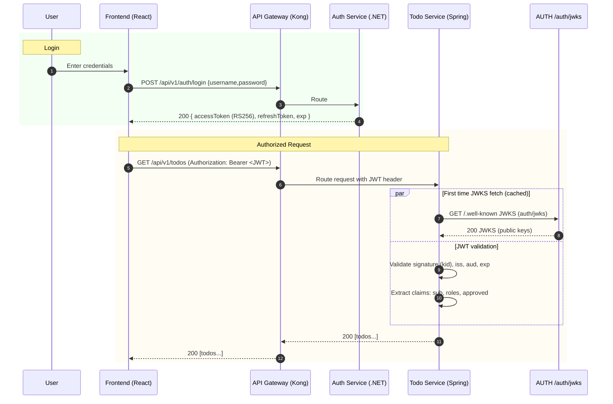
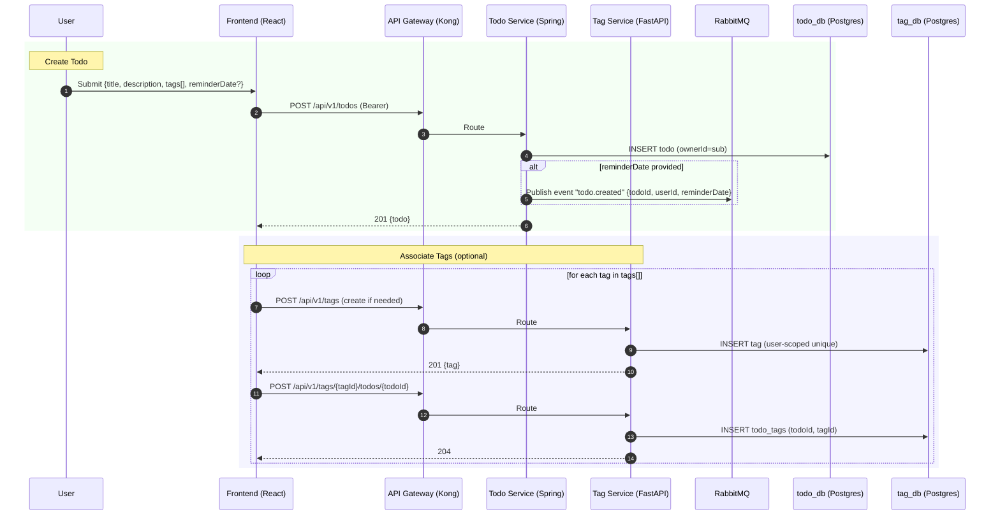
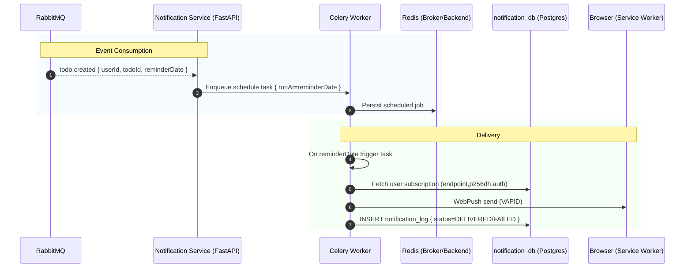
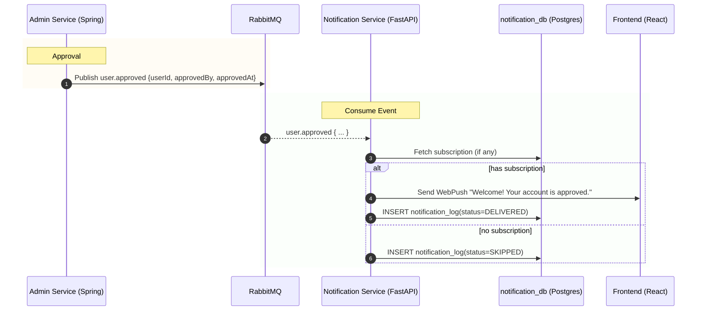

# Sequence Diagrams - Todo Microservices Solution

Version: 1.0
Date: February 5, 2026
Status: Approved

This document provides end-to-end sequence diagrams covering core user and system flows across the polyglot microservices architecture routed via the API Gateway (Kong). These flows align with ADR-001, HLD, and LLD.

Contents
- User Registration and Admin Approval
- User Login and JWT Validation via JWKS
- Create Todo with Tags and Event Publication
- Reminder Notification Scheduling and Delivery
- Admin Approval Event Publication and Impact

---

## 1) User Registration and Admin Approval

Notes:
- Registration handled by Auth Service; profile details exist in User Service (created on first login or via background sync, depending on implementation strategy).
- Admin approval flips status to ACTIVE. Pending users cannot log in.

---

## 2) User Login and JWT Validation via JWKS

Notes:
- Services cache JWKS and refresh periodically or on cache miss.
- If approved != true in token claims, requests are rejected with 403.

---

## 3) Create Todo with Tags and Event Publication

Notes:
- Tag Service does not synchronously validate todo existence; it relies on trusted IDs and eventual consistency policies.
- Event “todo.created” is consumed by Notification Service to schedule reminders.

---

## 4) Reminder Notification Scheduling and Delivery

Notes:
- VAPID keys are configured in Notification Service; failures logged and retried with exponential backoff.
- If subscription is invalid/expired, it’s pruned.

---

## 5) Admin Approval Event Publication and Impact

Notes:
- This event-driven approach decouples admin actions from notification side effects.
- Future consumers (e.g., analytics) can subscribe without changing the Admin Service.

---

## Error and Security Considerations

- All calls carry Authorization: Bearer <JWT>; services validate via JWKS and enforce approved==true.
- Gateway provides CORS, rate limiting, and request logging; services must handle 429 responses gracefully.
- Idempotency-Key supported on create endpoints (e.g., POST /todos).
- Errors follow the standard envelope with traceId for correlation across services.

---

Document History
- 1.0 (2026-02-05): Initial set of cross-service sequence diagrams
